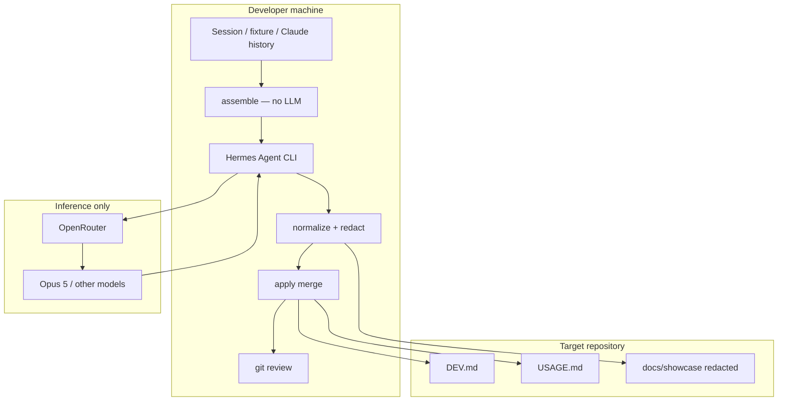
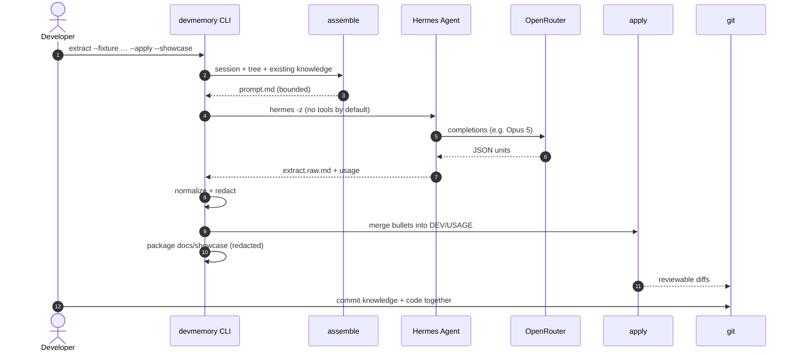

<p align="center">
  <a href="assets/devmemory-core.html"></a>
</p>

<h1 align="center">devmemory</h1>

<p align="center"><strong>Continuous knowledge extraction for AI-native software development</strong></p>

<p align="center">
  Local sessions → colocated <code>DEV.md</code> / <code>USAGE.md</code> · Hermes Agent · OpenRouter · dogfood traces
</p>

<p align="center">
  
  
  
  
  
</p>

<p align="center">
  <a href="assets/devmemory-core.html"><strong>Open the 3D living-memory artifact →</strong></a>
  ·
  <a href="docs/showcase/dogfood-run-20260731T021737-6f9c71/">Live Opus 5 showcase</a>
  ·
  <a href="docs/BUILD-LOG.md">Build log</a>
  ·
  <a href="docs/evals/">Evals</a>
</p>

---

## Why it exists

AI coding agents generate architecture decisions, trade-offs, commands, and pitfalls — then that knowledge **disappears when the session ends**. Git keeps the code; it does not keep the reasoning.

**devmemory** runs **locally**, extracts durable knowledge from development sessions, and writes it next to the code as:

| File | Answers |
|------|---------|
| **`DEV.md`** | How is this part built? (architecture, decisions, patterns, pitfalls) |
| **`USAGE.md`** | How do I work with it? (setup, commands, debugging) |

You review those files like any other source change. **No raw transcripts leave the machine. No private chats go to CI.**

---

## Dogfood first (this repo)

We do **not** demo on a random monorepo. We **build and document this product with itself**:

```text
improve code → pytest → live extract on self → update DEV/USAGE
           → redacted showcase → eval note → push → repeat
```

| Doc | Purpose |
|-----|---------|
| [`docs/BUILD-LOG.md`](docs/BUILD-LOG.md) | How the product was constructed |
| [`docs/evals/`](docs/evals/) | Rubrics + scored live runs |
| [`docs/experiments/`](docs/experiments/) | Hypotheses tried and kept/dropped |
| [`docs/showcase/…`](docs/showcase/dogfood-run-20260731T021737-6f9c71/) | Redacted Hermes traces, units, usage, timings |
| [`src/devmemory/DEV.md`](src/devmemory/DEV.md) | Package engineering knowledge (from Opus 5 dogfood) |
| [`src/devmemory/USAGE.md`](src/devmemory/USAGE.md) | Package ops knowledge |

**Live dogfood (verified):** `anthropic/claude-opus-5` via OpenRouter · `hermes_rc=0` · 6 units · ~35s · showcase published  
→ [`docs/showcase/dogfood-run-20260731T021737-6f9c71/`](docs/showcase/dogfood-run-20260731T021737-6f9c71/)  
→ eval: [`docs/evals/2026-07-31-dogfood-opus5.md`](docs/evals/2026-07-31-dogfood-opus5.md)

---

## High-level architecture



**Borrowed control plane (not forked):**

| Project | Role |
|---------|------|
| [luffy-pr-review-agent](https://github.com/Mr-Ashish/luffy-pr-review-agent) | assemble → `hermes -z` → normalize → trace pattern |
| [hermes-agent](https://github.com/NousResearch/hermes-agent) | Agent runtime CLI |
| [hermes-agent-self-evolution](https://github.com/NousResearch/hermes-agent-self-evolution) | Importer / redaction ideas; GEPA later |

---

## E2E agent flow



### Pipeline stages

```text
discover sessions
    → assemble (git status/diff/tree + EXISTING_DIRS + knowledge)
    → hermes -z  [OpenRouter · Opus 5]
    → normalize JSON KnowledgeUnit[]
    → apply (path snap · section canonicalize · bullet dedupe)
    → optional showcase package
    → human git review
```

### What “good apply” means

The model proposes knowledge. **The merge layer is the product:**

1. **Path snap** — never invent dirs; map onto real modules  
2. **Canonical sections** — Architecture / Design decisions / Patterns / Pitfalls · Setup / Common commands / Debugging  
3. **Bullet near-dupe skip** — re-runs do not thrash docs  
4. **Placeholder scrub** — no leftover `_(none yet)_`  
5. **Secrets** — redacted after JSON parse (pre-parse redaction breaks JSON)

---

## Quick start

```bash
git clone https://github.com/Mr-Ashish/devmemory.git
cd devmemory
python3 -m venv .venv && source .venv/bin/activate
pip install -e '.[dev]'

# OpenRouter key
export OPENROUTER_API_KEY=...          # or:
# export DEVMEMORY_ENV_FILE=/path/to/.env

# Hermes CLI (once)
./scripts/ensure-hermes.sh

# Offline (no API) — deterministic
devmemory extract --fixture sample-auth-module --offline --apply --force

# Live dogfood quality (Opus 5)
export DEVMEMORY_MODEL=anthropic/claude-opus-5
devmemory extract --fixture dogfood-build-narrative --apply --force --showcase

# Full smoke
./scripts/smoke-e2e.sh
pytest -q
devmemory review
```

Open the brand artifact locally:

```bash
open assets/devmemory-core.html   # or: python -m http.server 8765
```

---

## CLI

| Command | Purpose |
|---------|---------|
| `devmemory init` | `.devmemory/`, seed templates, gitignore |
| `devmemory list-sessions` | fixtures + Claude history for this repo |
| `devmemory extract` | full pipeline |
| `devmemory apply --run <id>` | re-apply prior `units.json` |
| `devmemory status` | processed sessions / recent runs |
| `devmemory review` | git status/diff for knowledge files |

### Extract flags

```bash
# dry-run (default): units + proposed paths + unified knowledge diff, no writes
devmemory extract --fixture dogfood-build-narrative --offline --force
# → prints colorized diff; writes .devmemory/out/<run>/preview.diff

# write DEV.md/USAGE.md + mark session processed
devmemory extract --fixture dogfood-build-narrative --apply --force \
  --model anthropic/claude-opus-5 --showcase

devmemory extract --session <id> --apply
devmemory extract --text-file ./notes.md --apply --force
devmemory extract --offline --apply          # heuristic, no Hermes
```

Dry-run preview is a **git-style unified diff** of every DEV.md/USAGE.md that would change (sequential multi-unit merge). Review `preview.diff`, then re-run with `--apply`.

### Claude Code hook (one-liner)

After a Claude Code session ends, extract durable knowledge without retyping the CLI:

```bash
# from repo root (pip install -e '.[dev]' + ensure-hermes once)
./scripts/install-claude-hook.sh
```

That merges a **SessionEnd** command hook into `.claude/settings.json` pointing at `scripts/claude-code-hook.sh`.

| Default | Why |
|---------|-----|
| **SessionEnd** (not every Stop) | Stop fires every turn; SessionEnd is once per session |
| **Background dry-run** | SessionEnd budget is short; Hermes must not block Claude |
| **Debounce 120s** | No thrash if hooks re-fire |
| **Offline if no key** | Still produces units without OpenRouter |
| **Log** | `<repo>/.devmemory/hooks.log` (gitignored) |

```bash
# print JSON fragment only
./scripts/install-claude-hook.sh --print

# also wire Stop (debounced; set DEVMEMORY_HOOK_ON_STOP=1)
./scripts/install-claude-hook.sh --with-stop

# user-global (~/.claude/settings.json)
./scripts/install-claude-hook.sh --user

# auto-write knowledge (review git after)
export DEVMEMORY_HOOK_APPLY=1
```

Manual one-liner for settings (absolute path to the script):

```json
{
  "hooks": {
    "SessionEnd": [{
      "hooks": [{
        "type": "command",
        "command": "/ABS/PATH/devmemory/scripts/claude-code-hook.sh",
        "timeout": 30
      }]
    }]
  }
}
```

| Env | Meaning |
|-----|---------|
| `OPENROUTER_API_KEY` | required for live |
| `DEVMEMORY_ENV_FILE` | load key from a sibling `.env` |
| `DEVMEMORY_MODEL` | default now `anthropic/claude-opus-5` |
| `DEVMEMORY_TOOLSETS` | empty by default; set `terminal` only if needed |
| `DEVMEMORY_OFFLINE=1` | force offline extract |
| `DEVMEMORY_HOOK_APPLY=1` | hook writes DEV/USAGE (default dry-run) |
| `DEVMEMORY_HOOK_ON_STOP=1` | allow per-turn Stop events (not recommended) |

---

## Live showcase anatomy

[`docs/showcase/dogfood-run-20260731T021737-6f9c71/`](docs/showcase/dogfood-run-20260731T021737-6f9c71/)

```text
units.json            normalized knowledge units
apply.json            files written
prompt.md             assembled prompt (bounded, redacted)
session.md            session body
repo-context.md       git + tree + existing knowledge
extract.raw.md        raw Hermes stdout
hermes-usage.json     tokens / estimated cost
summary.md            run summary + timings
agent-loop/
  agent-loop.json     structured loop metadata
  agent-loop.md       human walkthrough
  agent.log           redacted Hermes log slice
  usage.json          OpenRouter usage
  messages.json       best-effort session export
```

Example timings from the Opus 5 dogfood run:

| Stage | Seconds |
|-------|--------:|
| assemble | 0.08 |
| extract (Hermes + Opus 5) | 34.87 |
| normalize | 0.00 |
| apply | 0.01 |
| **total** | **~35** |

---

## Layout

```text
agent/                 Hermes SOUL, config, extract prompt
assets/devmemory-core.html   Three.js living-memory brand artifact
src/devmemory/         CLI + pipeline (+ package DEV.md/USAGE.md)
docs/
  BUILD-LOG.md
  ARCHITECTURE.md
  evals/
  experiments/
  showcase/            redacted live runs
fixtures/sessions/     sample + dogfood narratives
scripts/               ensure-hermes, smoke, e2e, Claude Code hook
tests/
```

---

## Privacy

- Runs on the developer machine  
- `.devmemory/` is gitignored (runs, Hermes home, state)  
- Knowledge files are intentional, reviewable commits  
- Showcase packaging redacts keys / Bearer tokens / env assignments  
- CI should validate **knowledge form**, never require raw transcripts  

---

## What belongs in a complete README? (checklist)

We treat this list as the product surface:

- [x] One-sentence + why  
- [x] Badges / brand / 3D artifact  
- [x] Architecture diagram  
- [x] E2E sequence (agent loop)  
- [x] Quick start + env vars  
- [x] CLI reference  
- [x] Dogfood philosophy + links to traces/evals/experiments  
- [x] Live showcase with timings/usage  
- [x] Privacy model  
- [x] Borrowed dependencies  
- [x] License  

Still useful later: release notes, CONTRIBUTING, video walkthrough.

---

## License

MIT
